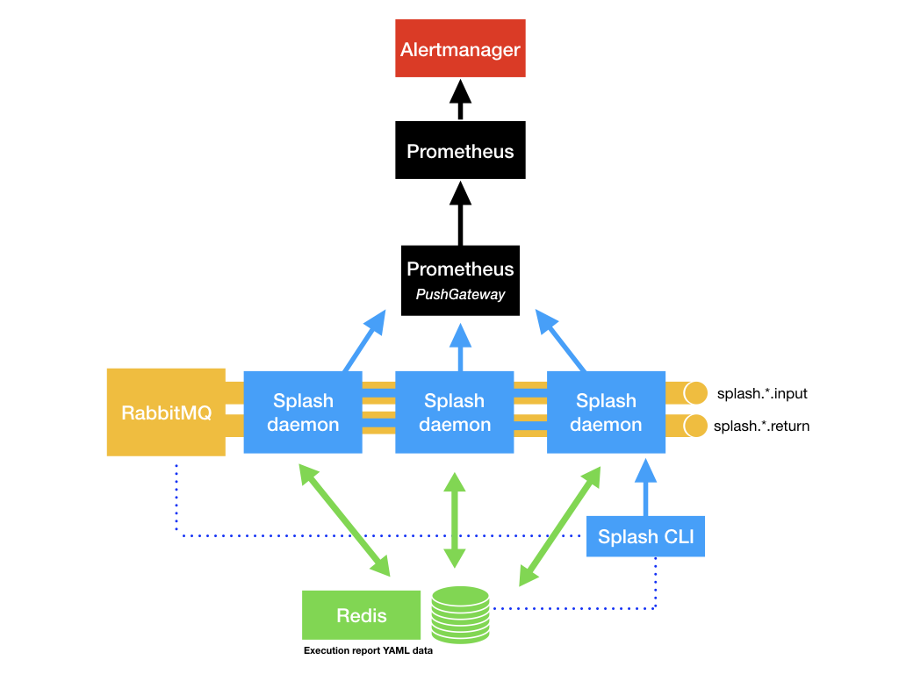
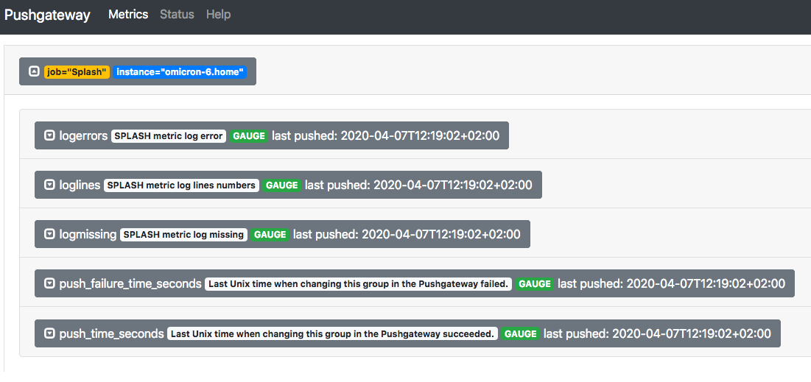
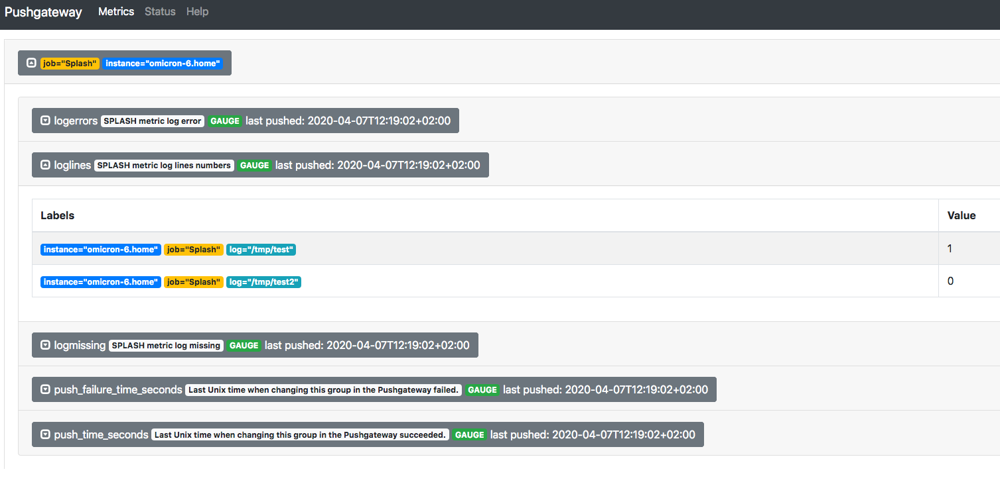

# Splash

 _Orchestration and Supervision made easy_

SPLASH is **Supervision with Prometheus of Logs and Asynchronous tasks orchestration for Services or Hosts**


Prometheus Logs and Batchs supervision over PushGateway


## Design



## Preconfiguration

You need a Prometheus PushGateway operational, if the service not run on localhost:9091,
See Prometheus server Configuration chapter to precise it in the configuration

You need Ruby on the server you want to run Splash
Splash is succesfully tested with Ruby 2.7.0, but it should works correctly with all Ruby 2.X versions.

On Ubuntu :

    # apt install ruby

In some use case, Splash also require some other components :

- Redis
- RabbitMQ

It's not strictly required, Redis is a real option for backend; you could configure backend to flat file, but
RabbitMQ is required by the Splash Daemon when using host2host sequence execution.

Redis, is usefull when you need a centralized Splash management.

On Ubuntu :

    # apt install redis-server rabbimq-server

See Backends Configuration  and Transports Configuration to specify this services configurations


## Installation


Install with gem command :

    $ gem install splash


## Configuration

As root or with rvmsudo, if you use RVM.

    # splash config setup              
    Splash -> setup :
    * Installing Configuration file : /etc/splash.yml : [OK]
    * Installing template file : /etc/splash_execution_report.tpl : [OK]
    * Creating/Checking pid file path : /var/lib/splash : [OK]
    * Creating/Checking trace file path : /var/lib/splash : [OK]
    Splash config successfully done.

*WARNING : if you have already configured Splash, running this command without --preserve flag, RESET the Splash Configuration.*


As root, edit /etc/splash.conf and adapt Prometheus Pushgateway Configuration :

    # vi /etc/splash.yml
    [..]
      :prometheus:
        :pushgateway:
          :host: <SERVER>
          :port: <PORT>
    [..]

With :

- SERVER : IP or fqdn of the Gateway.
- PORT : the specific TCP port of the Gateway.

If you have already setup, you could use --preserve option to keep your active configuration and report file on place
This is usefull for automatique Idempotent installation like with Ansible :

    # splash conf set --preserve


### Sanitycheck

As root or with rvmsudo, if you use RVM.

    # splash conf san
    Splash -> sanitycheck :
    * Config file : /etc/splash.yml : [OK]
    * PID Path : /tmp : [OK]
    * trace Path : /tmp/splash : [OK]
    * Prometheus PushGateway Service running : [OK]
    Sanitycheck finished with no errors

*WARNING* : setup or Sanitycheck could precises errors if path defined in configuration is *Symbolic links*, type :mode.
But it's not a problem for Splash to be operational.

For file/folders if problems is detected, it could be such as :

- :mode : UNIX rights errors
- :owner : UNIX file owner errors
- :group : UNIX file group errors
- :inexistant : file/folder is missing

### getting current VERSION

run :

    $ splash config version
    Splash version : 0.0.3, Author : Romain GEORGES <gems@ultragreen.net>
    Ultragreen (c) 2020 BSD-2-Clause


## Usage

### Logs monitoring

#### Edit your configuration


In the /etc/splash.yml, you need to adapt default config to monitor your logs.

    # vi /etc/splash.yml
    [..]
    ### configuration of monitored logs
      :logs:
        - :log: /a/log/path.log
          :pattern: <regexp pattern>
        - :log: /an/other/log/path.log
          :pattern: <regexp pattern
        - <etc...>
    [..]

Config for log is a YAML list of Hash, with keys :

- :log : a log absolut paths
- :pattern : a regular expression splash need to detect


#### Prerequisite

To ensure you have the default configuration values run as root :

    # splash conf set

*INFO* : comamnds must be reduce with the Thor completion facilities

To see all monitoring commands with Splash, run :

    # splash logs

or

    # slash logs help
    Commands:
      splash logs analyse         # analyze logs in config
      splash logs help [COMMAND]  # Describe subcommands or one specific subcommand
      splash logs list            # Show configured logs monitoring
      splash logs monitor         # monitor logs in config
      splash logs show LOG        # show configured log monitoring for LOG

*Typicallly, the way work with all Splash commands or subcommands*


#### Run a first test

Verify /tmp/test and /tmp/test2 not existence

    # rm /tmp/test /tmp/test2

Verify configured logs :

    # splash logs list
    Splash configured log monitoring :
     *  log monitor : /tmp/test
     *  log monitor : /tmp/test2

You could run list commands with --detail option , verify it with :

    # splash command subcommand help

like :

    # splash logs list --detail
    Splash configured log monitoring :
     *  log monitor : /tmp/test
      ->   pattern : /ERROR/
     *  log monitor : /tmp/test2
      ->   pattern : /ERROR/

You cloud view a specific logs record detail with

    # splash logs show /tmp/test2  
    Splash log monitor : /tmp/test2
      ->   pattern : /ERROR/

Run a first analyse, you would see :

    # splash logs analyse
    SPlash Configured logs status :
      * Log : /tmp/test : [KO]
        - Detected pattern : ERROR
        - detailled Status : missing
      * Log : /tmp/test2 : [KO]
        - Detected pattern : ERROR
        - detailled Status : missing
    Global Status : [KO]

Create empty Files, or without ERROR string in.

    # echo 'foo' > /tmp/test
    # touch /tmp/test2

Re-run analyse :

    # splash log an
    SPlash Configured logs status :
      * Log : /tmp/test : [OK]
        - Detected pattern : ERROR
        - detailled Status : clean
          nb lines = 1
      * Log : /tmp/test2 : [OK]
        - Detected pattern : ERROR
        - detailled Status : clean
          nb lines = 0
    Global Status : [OK]

It's alright, log monitoring work fine.

#### Send metrics to Prometheus gateway

Splash is made to run a specific daemon to do this job, but you could do one time, with :

    # splash logs monitor
    Sending metrics to Prometheus Pushgateway
      * Sending metrics for /tmp/test
      * Sending metrics for /tmp/test2
    Sending done.

if Prometheus Gateway is not running or misconfigured, you could see :

    Prometheus PushGateway Service IS NOT running
    Exit without notification.

Otherwise Prometheus PushGateway have received the metrics :


- *logerrors*, Prometheus Gauge : with label: <the logname> and job: 'Splash'
  => description : SPLASH metric log error'
  => content :<nb match> the number of pattern matching for the log

- *logmissing*, Prometheus Gauge : with label: <the logname> and job: 'Splash'
  => description : SPLASH metric log missing'
  => content :0 if log exist, 1 if log missing

- *loglines*, Prometheus Gauge : with label: <the logname> and job: 'Splash'
  => description : SPLASH metric log line numbers'
  => content :0 if log missing, <nb lines in the log> the number of lines in the logs

#### See it in Prometheus PushGateway

visit http://<prometheus_pushgateway_host>:<prometheus_pushgateway_port>/






### Commands Orchestration, running and monitoring

#### List of commands

To see all the commands in the 'commands' submenu :

    $ splash commands help

    $ splash commands                           
    Commands:
      splash commands help [COMMAND]   # Describe subcommands or one specific subcommand
      splash commands lastrun COMMAND  # Show last running result for specific configured command COMMAND
      splash commands list             # Show configured commands
      splash commands run NAME         # run for command/sequence or ack result
      splash commands show COMMAND     # Show specific configured command COMMAND
      splash commands treeview         # Show commands sequence tree

#### Prepare test with default configuration

Commands or Commands Sequences must be defined in the main configuration file '/etc/splash.yml'

Command name must be Ruby Symbols, so in the YAML file, it must look like :

    :xxxxxx:

_with x in the following list [A-Za-z_0-9]_


*Exemple* in default configuration :

    ### configuration of commands and scheduling
      :commands:
        :id_root:
          :desc: run id command on root
          :command: id root

        :true_test:
          :desc: "test command returning true : 0"
          :command: "true"
          :schedule:
            :every: "1h"
          :on_failure: :ls_slash_tmp
          :on_success: :pwd

        :false_test:
          :desc: "test command returning false > 0"
          :command: "false"
          :schedule:
            :every: "1h"
          :on_failure: :ls_slash_tmp
          :on_success: :pwd

        :ls_slash_tmp:
          :desc: list file in /tmp
          :command: ls -al /tmp
          :user: daemon
          :on_success: :echo1

        :pwd:
          :desc: run pwd
          :command: pwd
          :on_success: :echo1
          :on_failure: :echo2

        :echo1:
        :desc: echo 'foo'
        :command: echo foo
        :on_failure: :echo3

      :echo2:
        :desc: echo 'bar'
        :command: echo bar

      :echo3:
        :desc: echo 'been'
        :command: echo been

A configuration block for commands must include :

* *key* : a name as Symbol (:xxxxxx)
* *values* : (hash)
  * :desc : a brief Description
  * :command : the full command line

may include :

* :user: the userneme to use to run the command
* :on_failure: the name of an other defined command, to, execute if exit_code > 0
* :on_success: the name of an other defined command, to, execute if exit_code = 0
* :schedule:  (hash) a scheduling for daemon, after in this documentation, it support :
  * :every: "<timing>" ex: "1s", "3m", "2h"
  * :at: "<date/time>" ex: "2030/12/12 23:30:00"
  * :cron: * * * * * a cron format

[Rufus Scheduler Doc](https://github.com/jmettraux/rufus-scheduler)

if you want to inject default configuration, again as root :

  # splash conf set


#### listing the defined Commands

You could list the defined commands, in your case :

    $ splash commands list
    Splash configured commands :
    * id_root
    * true_test
    * false_test
    * ls_slash_tmp
    * pwd
    * echo1
    * echo2
    * echo3

#### Show specific commands

You could show a specific command :

    $ splash com show pwd
    Splash command : pwd
      - command line : 'pwd'
      - command description : 'run pwd'
      - command failure callback : 'echo2'
      - command success callback : 'echo1'

#### View Sequence execution for commands

You could trace execution sequence for a commands as a tree, with :

    # splash com treeview
    Command : true_test
      * on failure => ls_slash_tmp
        * on success => echo1
          * on failure => echo3
      * on success => pwd
        * on failure => echo2
        * on success => echo1
          * on failure => echo3

In your sample, in all case :
- :true_test return 0
- :pwd return 0
- :echo1 return 0

commands execution sequence will be :

:true_test => :pwd => :echo1

:ls_slash_tmp, :echo2 and :echo3 will be never executed.

#### Executing a standalone command :

Running a standalone command with ONLY as root

    # splash com execute echo1
    Executing command : 'echo1'
      * Tracefull execution
       => exitcode 0
      * Prometheus Gateway notified.

This command :

1. Execute command line defined in command 'echo1' defined in  configurations
2. Trace information in a execution report :
  - :start_date  the complete date time of execution start.
  - :end_date  the complete date time of execution end.
  - :cmd_name the name of the command
  - :cmd_line the complete command line executed
  - :stdout STDOUT of the command
  - :stderr STDERR of the command
  - :desc the description of the command
  - :status : PID and exit_code of the command
  - :exec_time : the timing of the command
3. Notify Prometheus

There is some usefull modifiers for this command :

    --no-trace : prevent Splash to write report for this execution in configured backend
    --no-notify : prevent Splash to nofify Prometheus PushGateway metric (see later in this documentation)
    --no-callback : never execute callback (see it after)


#### Executing a sequence of callback Commands

Splash allow execution of callback (:on_failure, :on_success), you have already see it in config sample.
In our example, we have see :true_test have a execution sequence, we're going to test this, as root :

    # splash com exe true_test
    Executing command : 'true_test'
      * Tracefull execution
       => exitcode 0
      * Prometheus Gateway notified.
      * On success callback : pwd
    Executing command : 'pwd'
      * Tracefull execution
       => exitcode 0
      * Prometheus Gateway notified.
      * On success callback : echo1
    Executing command : 'echo1'
    * Tracefull execution
     => exitcode 0
    * Prometheus Gateway notified.

We could verify the sequence determined with lastrun command.

If you want to prevent callback execution, as root :

      # splash com exe true_test --no-callback
      Executing command : 'true_test'
       * Tracefull execution
        => exitcode 0
       * Prometheus Gateway notified.
       * Without callbacks sequences

#### Display the last execution trace for a command

If you want to view the last execution trace for  commande, (only if executed with --trace : default)

    # splash com lastrun
    Splash command pwd previous execution report:

    Command Execution report
    ========================

    Date START: 2020-04-07T18:25:22+02:00
    Date END: 2020-04-07T18:25:22+02:00
    Command : pwd
    full command line : pwd
    Description : run pwd
    errorcode : pid 86782 exit 0
    Execution time (sec) : 0.006568

    STDOUT:
    -------

    /Users/ruydiaz/labo/prometheus-splash


    STDERR:
    -------


Lastrun could receive the --hostname option to get the execution report of command


### Advanced  Configuration

#### Backend configuration

For the moment Splash come with two types of backend :
- :file if you would a standalone splash Usage
- :redis if you want a distributed Splash usage

backend are usable for :

- execution trace

##### File backend

The file backend is very simple to use :

Edit /etc/splash.yml, as root :

    # vi /etc/splash.yml
    [...]
    :backends:
      :stores:
        :execution_trace:
            :type: :file
            :path: /var/run/splash
    [...]

- :type must be :file
- :path should be set to the dedicated executions traces files path (default : /var/run/splash )

##### Redis backend

A little bit more complicated for Redis :

Edit /etc/splash.yml, as root :

    # vi /etc/splash.yml
    [...]
    :backends:
      :stores:
        :execution_trace:
          :type: :redis
          :host: localhost
          :port: 6379
          #:auth: "mykey"
          :base: 1
    [...]

- :type must be :redis
- :host must be set as the Redis server hostname (default: localhost)
- :port must be set as the Redis server port (default: 6379)
- :base must be set as the Redis base number (default: 1)
- :auth should be set if Redis need an simple authentification key <mykey>

##### Prometheus PushGateway configuration

Prometheus PushGateway could be configured in /etc/splash.yaml

    # vi /etc/splash.yml
    [...]
      :prometheus:
        :pushgateway:
          :host: "localhost"
          :port: 9091
    [...]

-  :host should be set as the Prometheus PushGateway hostname (default: localhost)
-  :port should be set as the Prometheus PushGateway port (default: 9091)

### The Splash daemon

#### Introduction

We're going to discover the Big part of Splash the Daemon, usefull to :

- orchestration
- scheduling
- Log monitoring (without CRON scheduling)
- host2host sequences execution (optionnal )

#### Controlling the daemon

TODO

#### Configuring the daemon

TODO


### Ecosystem

#### Execution report Template adaptions

TODO

#### Ubuntu Ansible playbook

TODO

#### Systemd integration fo daemon

TODO

#### CRON usage with or without rvmsudo

TODO

#### Default values for configuration

 defined in the lib/splash/constants.rb

```ruby

# the only one non-overridable by the configuration
CONFIG_FILE = "/etc/splash.yml"


TRACE_PATH="/var/run/splash"

DAEMON_LOGMON_SCHEDULING={ :every => '20s'}
DAEMON_PROCESS_NAME="Splash : daemon."
DAEMON_PID_PATH="/var/run"
DAEMON_PID_FILE="splash.pid"
DAEMON_STDOUT_TRACE="stdout.txt"
DAEMON_STDERR_TRACE="stderr.txt"

AUTHOR="Romain GEORGES"
EMAIL = "gems@ultragreen.net"
COPYRIGHT="Ultragreen (c) 2020"
LICENSE="BSD-2-Clause"

PROMETHEUS_PUSHGATEWAY_HOST = "localhost"
PROMETHEUS_PUSHGATEWAY_PORT = "9091"

EXECUTION_TEMPLATE="/etc/splash_execution_report.tpl"
EXECUTION_TEMPLATE_TOKENS_LIST = [:end_date,:start_date,:cmd_name,:cmd_line,:stdout,:stderr,:desc,:status,:exec_time]

BACKENDS_STRUCT = { :list => [:file,:redis],
                    :stores => { :execution_trace => { :type => :file, :path => "/var/run/splash" }}}
TRANSPORTS_STRUCT = { :list => [:rabbitmq],
                    :active => :rabbitmq,
                    :rabbitmq => { :url => 'amqp://localhost/'} }

```


#### Splash CLI return code significations
```ruby
EXIT_MAP= {

   # context execution
   :not_root => {:message => "This operation need to be run as root (use sudo or rvmsudo)", :code => 10},
   :options_incompatibility => {:message => "Options incompatibility", :code => 40},
   :service_dependence_missing => {:message => "Splash Service dependence missing", :code => 60},

   # config
   :specific_config_required => {:message => "Specific configuration required", :code => 30},
   :splash_setup_error => {:message => "Splash Setup terminated unsuccessfully", :code => 25},
   :splash_setup_success => {:message => "Splash Setup terminated successfully", :code => 0},
   :splash_sanitycheck_error => {:message => "Splash Sanitycheck terminated unsuccessfully", :code => 20},
   :splash_sanitycheck_success => {:message => "Splash Sanitycheck terminated successfully", :code => 0},
   :configuration_error => {:message => "Splash Configuration Error", :code => 50},


   # global
   :quiet_exit => {:code => 0},

   # events
   :interrupt => {:message => "Splash user operation interrupted", :code => 33},

   # request
   :not_found => {:message => "Object not found", :code => 44},
   :already_exist => {:message => "Object already exist", :code => 48},

   # daemon
   :status_ok => {:message => "Status OK", :code => 0},
   :status_ko => {:message => "Status KO", :code => 31}
```
}

### In the Futur ?

- IHM
- Webservice


## Contributing

1. Fork it
2. Create your feature branch (`git checkout -b my-new-feature`)
3. Commit your changes (`git commit -am 'Add some feature'`)
4. Push to the branch (`git push origin my-new-feature`)
5. Create new Pull Request
